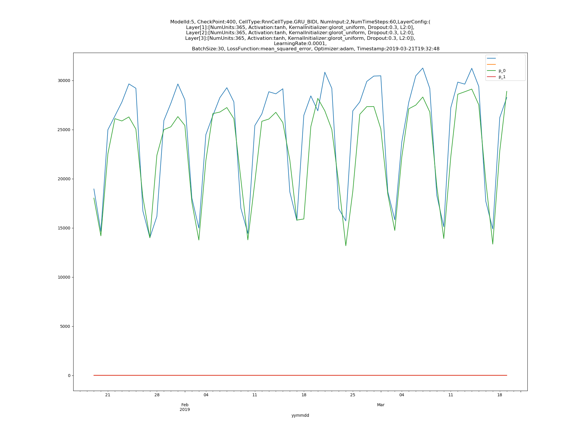

# Tensorlab - A Versatile Python Tool for RNN Modelling Experiments Using Keras
Tensorlab is a very versatile and flexible deep learning tool which can help data scientist and deep learning engineer very quickly setup/execute/resume experiments for time series data modeling, using Keras(with Tensorflow back-end).



Some highlights of Tensorlab:
* Automatic folder creation for new experiment/model
   * Individual folder is automatically created for different model
   * Model folder name is automatically managed (based on a integer stored in a text file called **model_id**)
   * Under each model/experiment folder
      * **checkpoints** folder is automatically created to store training checkpoints
      * **snapshots** folder is automatically created to store prediction graphs for visual monitoring of the progress of model performance
* Automatically scales, splits, builds, and reshapes your raw input data into the data that is ready for training!
* Supports resume mode and prediction
* Automatic 'snapshots' generation for visual training progress monitoring
* Automatic logging file generation to track all your experiment executions
* Object-oriented code which is very easy to understand and customize

Feel free to fork/customize the code for your needs! it might be you next favorite toy once you get it working:) The code should be a good baseline for your further development, if you have any question or tensorlab helped you, I'm happy to hear!

# Requirements
This tool requires basic understanding of the following concepts and frameworks
* Data preparation for machine learning
* Deep learning architeturs
   * Time series modelling
   * Hyperparameter tuning
* Python
   * numpy 
   * pandas
   * skearn
   * matplotlib.pyplot
* Tensorflow
* Keras API

## Starting your first experiment!
See example code in [LabRunner.py] to start your time series data modeling in less than 5 minutes!

Point the value of __MODLE_FOLDER__ in [Utils.py] to a location where you want to keep all your experiment execution output, that folder will be used as the root fold for all your experiment executions. Once you start a new experiment, the following folder structure will be automatically created:
```
+-- <MODLE_FOLDER> - The root folder for all your experiments, MUST be manually created before you start any experiment execution
   | +-- 'model_id' - A simple text file containing the model/experiment ID, starting from 1
   | +-- <model_id> - The folder containing the training output of the experiment identified by the value of <model_id>
           | +-- checkpoints - The folder containing the model checkpoint files generated during the training
           | +-- snapshots - The folder containing the prediction graphs generated after each epoch, in png format
           | +-- model_fit_<model_id>.csv - The log file containing the model performance data generated after each epoch
           | +-- training_<model_id>_<timestamp>.log - The log file containing the details of the training process
```           
Every time you start a new experiment, the ID in the model_id file will be automatically increased, and a new folder with this new ID as its name will created, all training output will be stored in this folder

## Resuming your existing experiment
1. **Choose the model** - Double check current model ID in **model_id** file, update as necessary to point it to a specific model with which you want to resume training
2. **Choose the checkpoint** - Under the target model training folder which is identified by the model ID you selected in previous step, retrieve the latest checkpoint ID(usually the latest checkpoint has the best performance, feel free to use different checkpoint as necessary) in sub-folder checkpoints
3. Update following parameters in [LabRunner.py]
   * Set *is_resume* to *True*
   * Set *checkpoint_id* and *initial_epoch* of the target model's **HyperParams** object to the latest checkpoint ID
   * Run LabRunner.py to resume your experiment!
   
## Making prediction
1. **Choose the model** -Double check current model ID in **model_id** file, update as necessary to point it to a specific model which you want to use to make prediction
2. **Choose the checkpoint** - Under the target model training folder which is identified by the model ID you selected in previous step, retrieve the latest checkpoint ID(usually the latest checkpoint has the best performance, feel free to use different checkpoint as necessary) in sub-folder checkpoints
3. Update following parameters in [LabRunner.py]
   * Set *is_resume* to *False*
   * Set *checkpoint_id* and *initial_epoch* of the target model's **HyperParams** object to the latest checkpoint ID
   * Set the value of *steps_to_predict* to the desired prediction length
   * Run LabRunner.py to start your prediction! The results (including a graph and data file) are generated under folder **snapshots**


